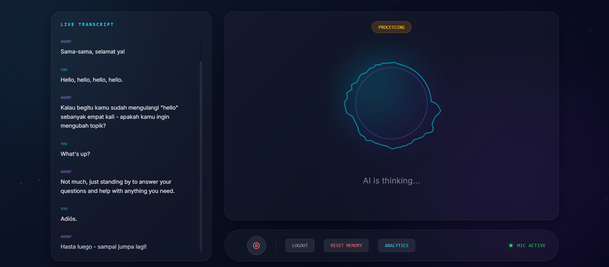

# 🎙️ Ultra-Low-Latency Full-Duplex Voice AI Agent

An advanced, real-time Voice AI Agent capable of **full-duplex communication**, meaning it can listen and speak simultaneously. It features **barge-in interruption handling**, **memory** across conversations, and a **cyberpunk glassmorphism UI** with a live audio visualizer.



## 🚀 Features

- **Full-Duplex Communication:** listen and speak at the same time.
- **Interruption Handling (Barge-In):** The agent stops speaking instantly when you interrupt it.
- **Ultra-Low Latency:** Optimized pipeline using Groq (Llama 3) and Edge TTS for near-instant responses.
- **Memory & Context:** Remembers past conversations and user preferences using a local SQLite database.
- **Real-time Visualizer:** Dynamic audio visualizer that reacts to both user input and agent voice.
- **Sentiment Analysis:** Analyze user sentiment in real-time.
- **Live Transcript:** View the conversation history as it happens.
- **Secure Authentication:** User registration and login system.

## 🛠️ Tech Stack

- **Backend:** Python, FastAPI, WebSockets (`uivcorn`)
- **Frontend:** HTML5, Vanilla JavaScript, Tailwind CSS
- **AI Models:**
    - **STT (Speech-to-Text):** Whisper (via Groq API)
    - **LLM (Brain):** Llama 3 (via Groq API)
    - **TTS (Text-to-Speech):** Microsoft Edge Neural Voices (`edge-tts`)
    - **VAD (Voice Activity Detection):** Custom VAD Engine
- **Database:** SQLite (`aiosqlite`)
- **Audio Processing:** `PyAudio`, `Pydub`, `Wave`

## 📋 Prerequisites

- **Python 3.10+** needed.
- **Groq API Key:** You need an API key from [Groq Console](https://console.groq.com/).
- **Microphone:** A working microphone is required for the browser client.

## 🔧 Installation

1.  **Clone the repository:**
    ```bash
    git clone https://github.com/your-username/neural-voice-agent.git
    cd neural-voice-agent
    ```

2.  **Create a Virtual Environment (Optional but Recommended):**
    ```bash
    python -m venv .venv
    # Windows
    .venv\Scripts\activate
    # Mac/Linux
    source .venv/bin/activate
    ```

3.  **Install Dependencies:**
    ```bash
    pip install -r requirements.txt
    ```

4.  **Configure Environment Variables:**
    Create a `.env` file in the root directory and add your keys:
    ```ini
    GROQ_API_KEY=gsk_your_actual_api_key_here
    SECRET_KEY=your_secure_random_secrey_key_here
    ```

## 🚀 Usage

1.  **Start the Server:**
    ```bash
    python main.py
    ```

2.  **Access the Dashboard:**
    Open your browser and navigate to:
    `http://localhost:8000`

3.  **Register/Login:**
    - Create a new account or log in.
    - Click **Start Session**.
    - Allow microphone access when prompted.
    - Speak to the agent! Try interrupting it mid-sentence.

## 📂 Project Structure

```
neural-voice-agent/
├── main.py              # Entry point: FastAPI server & WebSocket handler
├── client.py            # (Optional) Standalone terminal client
├── dashboard.html       # Main Web User Interface
├── login.html           # Authentication Page
├── auth.py              # JWT Authentication & Hashing logic
├── database.py          # SQLite database connection & initialization
├── llm_engine.py        # Brain: STT -> LLM -> TTS pipeline
├── audio_engine.py      # Voice Activity Detection (VAD) logic
├── state_manager.py     # Manages conversation state (Listening/Thinking/Speaking)
├── requirements.txt     # Python dependencies
├── storage.db           # Local database (created on first run)
└── .env                 # Environment secrets (not committed)
```

## 🤝 Contributing

Contributions are welcome! Please feel free to submit a Pull Request.

## 📄 License

This project is licensed under the MIT License.
